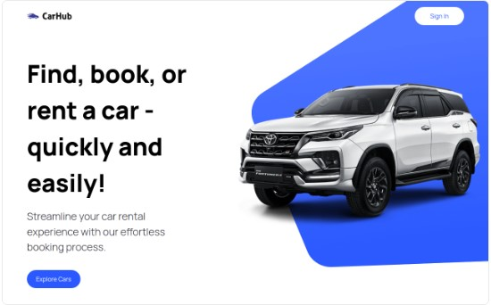

# Build and Deploy a Next.js 13 Car Dealership Site | React, Next.js 13, TypeScript, Tailwind CSS

## Car Showcase

### Introduction
As an experienced UI developer, I present to you a state-of-the-art car dealership site built with Next.js 13. This application leverages the latest features of Next 13, including server-side rendering and the app router, to provide a seamless user experience.

 

*Screenshot of the Car Dealership Site*

### Features
- **Next.js 13 App Router and Server Side Rendering**: Fast navigation and optimal performance.
- **Advanced Search Functionality**: Find the perfect car with ease.
- **Filtering Capabilities**: Narrow down choices with custom filters.
- **Optimize Metadata and SEO**: Enhance visibility on search engines.
- **Custom Elements**: Including filters, comboboxes, and modals.
- **Clean Code**: Embrace the principles of writing clean, maintainable code.

### Dependencies
```json
{
  "@headlessui/react": "^1.7.16",
  "@types/node": "20.4.9",
  "@types/react": "18.2.19",
  "@types/react-dom": "18.2.7",
  "autoprefixer": "10.4.14",
  "next": "13.4.13",
  "postcss": "8.4.27",
  "react": "18.2.0",
  "react-dom": "18.2.0",
  "tailwindcss": "3.3.3",
  "typescript": "5.1.6"
}
```

## Getting Started

First, run the development server:

```bash
npm run dev
# or
yarn dev
# or
pnpm dev
```

Open [http://localhost:3000](http://localhost:3000) with your browser to see the result.

### Conclusion
Explore the modern world of car showcasing with this Next.js 13 application. Built with precision and expertise, this site is a testament to the capabilities of modern web development.

